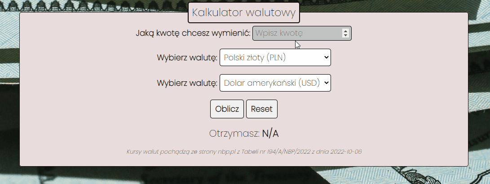

# **Currency-converter**

## DEMO
**[My currency-converter](https://rkowal10.github.io/currency-converter/)**

That simple currency converter is the second project that I did during the course.

## User manual
1. Enter the value in the field "Jaką kwotę chcesz wymienić chcesz wymienić".
2. Select the initial currency.
2. Select the final currency.
3. Press "Oblicz" when you want to calculate the value or "Reset" when you want to delete changes.
